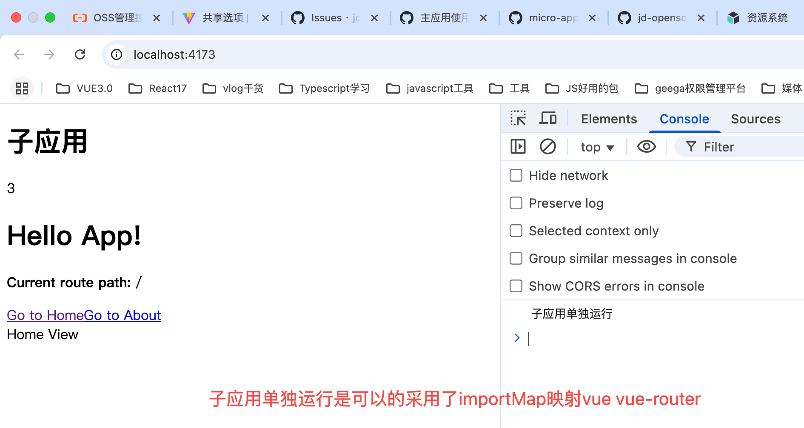
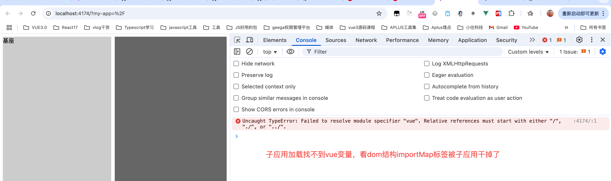
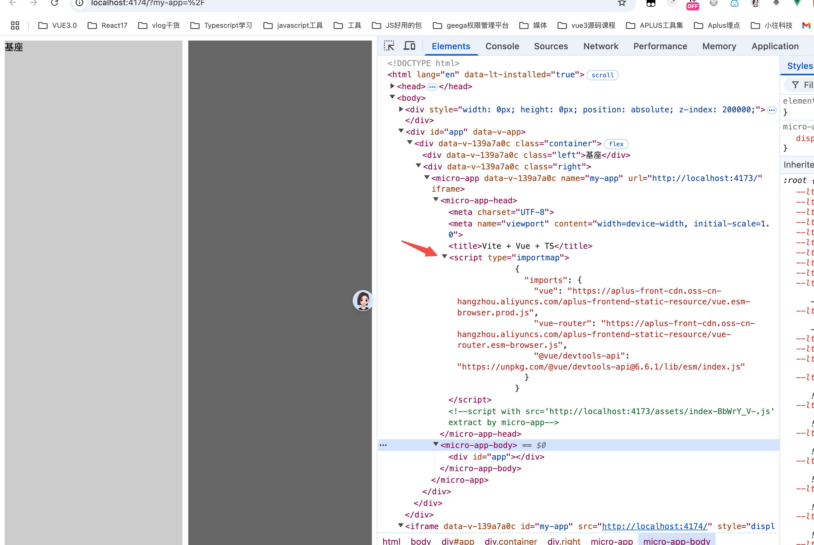

# importmap 在子应用沙箱环境中不生效

base-module-federation 是基座,子应用是 sub-module-federation，基座和子应用都用 vite 打包配置如下:

忽略 vue,和 vue-router 采用 cdn 映射到全局

```typescript
import { defineConfig } from "vite";
import vue from "@vitejs/plugin-vue";
import { createHtmlPlugin } from "vite-plugin-html";
export default defineConfig({
  plugins: [
    vue(),
    createHtmlPlugin({
      minify: false,
      inject: {
        data: {
          injectScript: `
           <script type="importmap">
            {
              "imports": {
                "vue": "https://aplus-front-cdn.oss-cn-hangzhou.aliyuncs.com/aplus-frontend-static-resource/vue.esm-browser.prod.js",
                "vue-router": "https://aplus-front-cdn.oss-cn-hangzhou.aliyuncs.com/aplus-frontend-static-resource/vue-router.esm-browser.js",
                "@vue/devtools-api": "https://unpkg.com/@vue/devtools-api@6.6.1/lib/esm/index.js"
              }
            }
          </script>
          `,
        },
      },
    }),
  ],
  server: {
    headers: {
      "Access-Control-Allow-Origin": "*",
    },
  },
  build: {
    rollupOptions: {
      external: ["vue", "vue-router"],
      output: {
        format: "es",
        paths: {
          vue: "https://aplus-front-cdn.oss-cn-hangzhou.aliyuncs.com/aplus-frontend-static-resource/vue.esm-browser.prod.js",
          "vue-router":
            "https://aplus-front-cdn.oss-cn-hangzhou.aliyuncs.com/aplus-frontend-static-resource/vue-router.esm-browser.js",
        },
      },
    },
  },
});
```

## 子应用可以独立运行



## 微前端环境下子应用失效

貌似 importmap 在子应用沙箱环境中不生效



